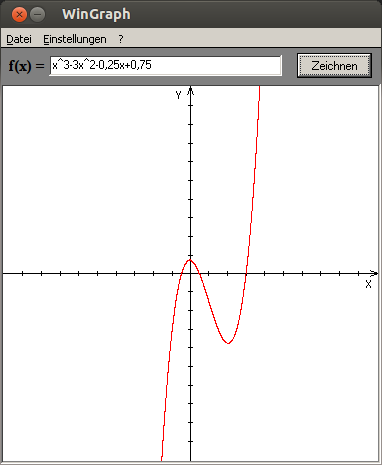

WinGraph
========

This program is written and compiled with the Turbo C++ 2006 Explorer Edition

## Creator

**Stefan Hüsges**

:computer: [Homepage][1]

:octocat: [GitHub][2]

## Screenshot

## Hidden Function

* Press __Ctrl + Shift + F8__ to switch the mode.
* Press __Ctrl + Shift + F7__ to switch back.

## License

[][3]

## Foreign Code

The files _funktion.cpp_, _funktion.h_, _mathlib.cpp_ and _mathlib.h_ are copyright by __W. Boeck__. 

The function _GetEncoderClsid_ is copied from [here][4]

[1]: http://www.mpcx.net
[2]: https://github.com/tronsha
[3]: http://www.gnu.org/licenses/gpl-3.0
[4]: http://msdn.microsoft.com/en-us/library/windows/desktop/ms533843(v=vs.85).aspx
